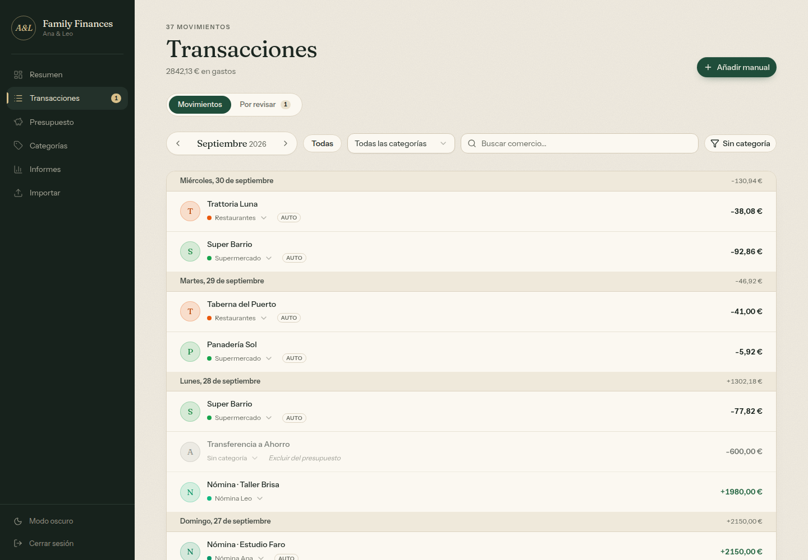
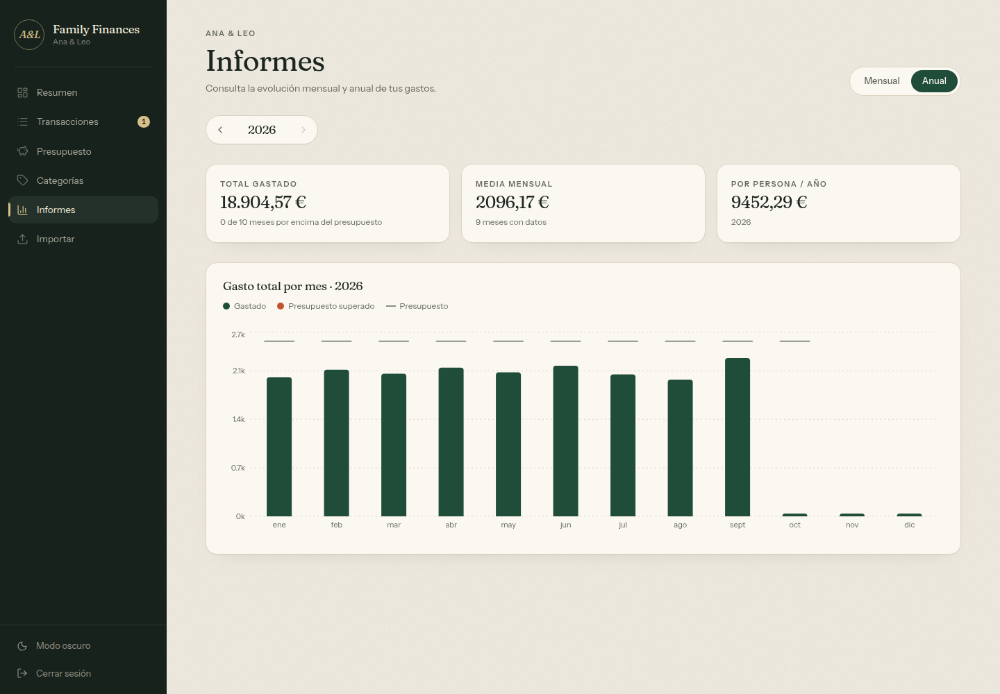
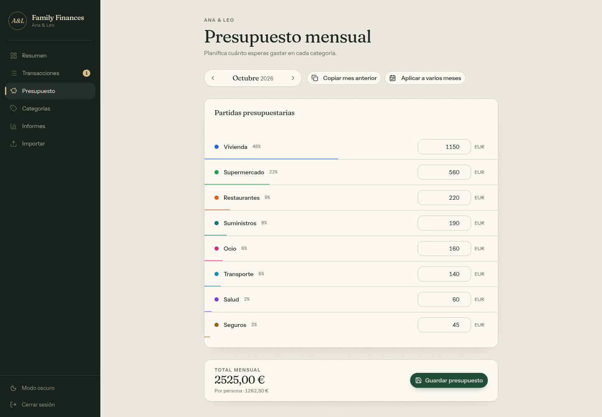
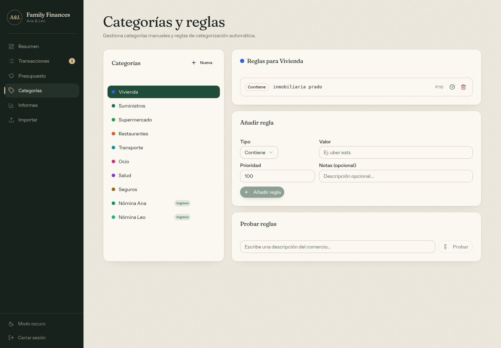

# Family Finances

Family Finances is a self-hostable household budget app built with Next.js, Drizzle, PostgreSQL and Supabase Auth.

It is designed as a reusable starter, not a hosted SaaS. One deployment maps to one household database. A fresh clone signs in, completes `/setup`, and chooses either a blank workspace or a generic starter template. Import your bank statements and the app learns how you categorize, so most new transactions file themselves.


<sub>All screenshots use a fictional demo household ("Ana & Leo") and invented transactions.</sub>

## Screenshots

| Transactions | Review queue |
| --- | --- |
|  |  |
| **Yearly report** | **Budget** |
|  |  |
| **Dark mode** | **Categories and rules** |
|  |  |

On phones the sidebar becomes a drawer and every page fits the screen without sideways scrolling:

<p>
  
  
  
</p>

## Features

- **Dashboard.** Spending against the budget, with a pace chart that shows whether you are ahead of an even spend. Also shows income, margin, per-person spending, categories with status labels, and recent activity. On the 1st of a month it opens on the last month with data.
- **Smart auto-categorization.** It learns from every transaction you categorize: merchant names are normalized, past examples vote weighted by how close their amount is, and similar-looking merchants are matched too. Confident predictions are applied on import; the rest wait in a review queue where you accept, change or dismiss them. See [docs/categorization.md](docs/categorization.md).
- **Optional Claude suggestions** for merchants the household has never seen, enabled by setting `ANTHROPIC_API_KEY`. Only descriptions and amounts are sent, and results are always suggestions.
- **Rules** (`contains`, `exact`, `starts with`, `regex`) take precedence over learning. They match whole words and ignore accents.
- **Monthly budgets** per category, copied from the previous month or applied to several months at once.
- **Reports**: monthly breakdown with a distribution chart, and a yearly view with each month's budget drawn as a tick.
- **Transactions**: day-grouped ledger, inline category picker, search and filters, manual entries, notes. Each transaction can be split over 12 months as an annual expense, counted in another month, or excluded from the budget.
- **CSV import** for Revolut exports (Spanish and English), with duplicate detection and reverted (`DEVUELTO`/`REVERTED`) rows skipped.
- **Design**: warm "ledger" look with a separately designed dark mode that loads without a flash. It is responsive down to 375 px phones, and status is always shown with an icon and a label, never by color alone.
- **First-run setup wizard** for app name, household name, locale, currency, timezone and household size. The UI is localized in English and Spanish.

## Stack

- Next.js 16 (App Router, `proxy.ts`) and React 19
- TypeScript, Zod for API validation
- Drizzle ORM on PostgreSQL (Supabase)
- Supabase Auth
- Tailwind CSS 4 with shadcn/ui primitives, Recharts
- Anthropic SDK (optional, for Claude suggestions)
- Vitest and GitHub Actions CI

## Product Model

- One deployment = one household
- Authentication is handled with Supabase Auth
- App configuration is stored in `app_settings`
- `db:seed` stays minimal on purpose
- Starter categories, starter rules and optional starter budgets are created during `/setup`

## Quick Start

1. Install dependencies.

```bash
npm install
```

2. Copy the example environment file.

```bash
cp .env.example .env.local
```

3. Create a Supabase project at [supabase.com](https://supabase.com) and fill in `.env.local`:

- `DATABASE_URL`: found in **Project Settings → Database → Connection string → URI** (use the pooler URI for Vercel deployments)
- `NEXT_PUBLIC_SUPABASE_URL`: found in **Project Settings → API → Project URL**
- `NEXT_PUBLIC_SUPABASE_ANON_KEY`: found in **Project Settings → API → anon / public key**
- `ANTHROPIC_API_KEY` (optional): enables "Ask Claude" for unfamiliar merchants

4. Run database migrations and seed.

```bash
npm run db:setup
```

This runs `db:migrate` and `db:seed`. Migrations are committed in `db/migrations`; run `npm run db:generate` only after changing `db/schema.ts`, and commit the generated migration.

5. Create your first user in Supabase Auth.

Go to **Authentication → Users → Add user** in the Supabase dashboard, choose *Create new user*, and enter an email and password. This is the account you will use to sign in.

Then turn off public sign-ups in **Authentication → Sign In / Providers → Allow new users to sign up**. Every signed-in user has full access to the household data, and the anon key is public, so with sign-ups enabled anyone could create an account.

6. Start the app locally.

```bash
npm run dev
```

7. Open [http://localhost:3000/login](http://localhost:3000/login), sign in with the user you just created, and complete `/setup`.

## First-Run Setup

The first authenticated user is redirected to `/setup` until the workspace is configured. The setup flow lets you:

- choose the visible app name
- choose the household name
- pick locale, currency, timezone and household size
- start blank or use a generic starter template
- optionally create starter monthly budgets for the current month

## Environment Variables

| Variable | Required | Description |
| --- | --- | --- |
| `DATABASE_URL` | Yes | PostgreSQL connection string used by Drizzle and the API routes |
| `NEXT_PUBLIC_SUPABASE_URL` | Yes | Supabase project URL |
| `NEXT_PUBLIC_SUPABASE_ANON_KEY` | Yes | Supabase anonymous key for browser auth |
| `ANTHROPIC_API_KEY` | No | Enables Claude suggestions for merchants the household has never categorized. Server-side only |

## Local Development Workflow

```bash
npm run dev         # start the dev server
npm run lint        # ESLint
npm run typecheck   # tsc --noEmit
npm test            # Vitest unit tests
npm run build       # production build
npm run db:migrate  # apply committed migrations
npm run db:seed     # minimal seed
npm run db:generate # only after editing db/schema.ts
```

CI (`.github/workflows/ci.yml`) runs lint, typecheck, tests and build on pushes to `main` and on pull requests.

## Deploying on Vercel

### Recommended setup

1. Create a Supabase project at [supabase.com](https://supabase.com).
2. Import this repo into Vercel and add the environment variables from `.env.example` in the Vercel project settings.
3. Run the migrations against your Supabase database. You can do this locally by pointing `DATABASE_URL` at your production database and running:

```bash
npm run db:setup
```

4. Go to **Authentication → Users → Add user** in the Supabase dashboard and create your first user, then disable **Allow new users to sign up**.
5. Open the deployed app, sign in, and complete `/setup`.

When you update an existing deployment, run `npm run db:migrate` **before** the new code goes live: new code can depend on columns added by new migrations (for example `0006_categorization_suggestions`).

### Notes

- The app reads and writes data only on the server through `DATABASE_URL`. The migrations enable RLS and revoke table access for the `anon` and `authenticated` roles, so the Supabase Data API exposes nothing. Keep it that way: do not add permissive RLS policies.
- In production the app refuses to serve requests (HTTP 503) when the Supabase variables are missing, instead of running without authentication.
- This repo does not create a hosted multi-tenant product. Each deployment should use its own database.
- The public anonymous Supabase key is expected in the browser. Do not place service-role keys in this app.

## CSV Import Support

The parser supports Revolut CSV exports in Spanish and English: headers, states, and amount formats such as `1.234,56` or `1,234.56`. Some similar bank statements may also work.

Arbitrary bank CSV formats are not guaranteed yet. To support another bank, add a parser in `lib/csv-parser.ts`.

Imports are idempotent. Each row gets a fingerprint (date, description, amount, type and running balance), so re-uploading an overlapping statement only adds the new rows. After an import the app reports how many rows were auto-categorized and how many need review.

## Documentation

| Document | What it covers |
| --- | --- |
| [docs/categorization.md](docs/categorization.md) | How auto-categorization works: rules, learning, similarity, confidence, review queue, Claude |
| [docs/architecture.md](docs/architecture.md) | Project layout, pages, API routes, data model, budget rules, import pipeline, security |
| [docs/design.md](docs/design.md) | Design tokens, typography, UI kit components, charts, mobile rules |
| [CHANGELOG.md](CHANGELOG.md) | What changed, release by release |

## Repository Hygiene

This repository is intended to stay safe to publish publicly:

- do not commit `.env.local` or any other real env files
- do not commit Supabase CLI temp state from `supabase/.temp`
- do not commit production exports, CSV statements, database dumps, or screenshots of real data
- do not add service-role credentials or private API tokens to client code

## Extending the Starter

Typical next steps if you want to build beyond the starter:

- add more bank-specific CSV parsers
- add recurring transaction support
- add household member permissions
- add attachments or receipt storage
