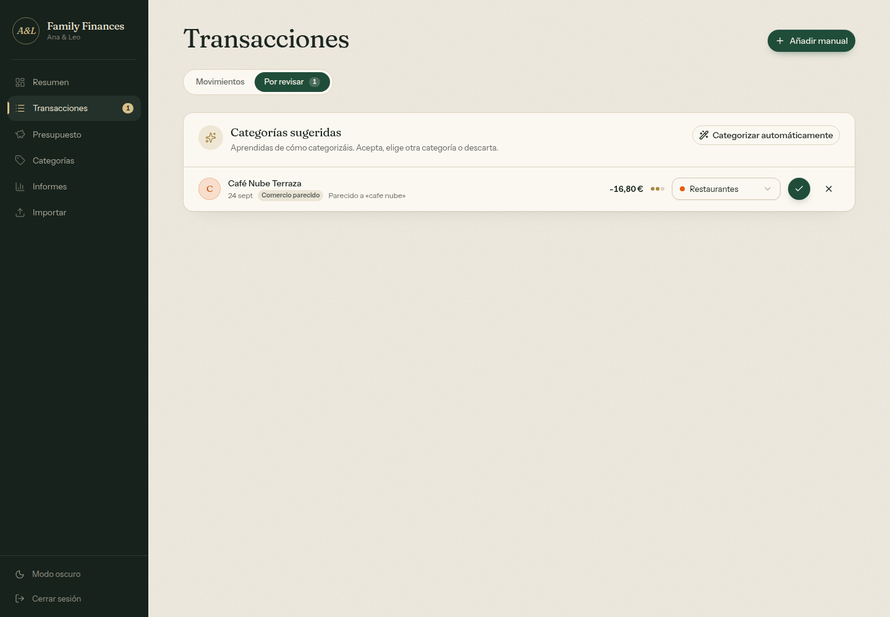

# Auto-categorization

New transactions are categorized in up to four steps. The first step that produces an answer decides, and every answer carries a confidence that controls whether it is applied or only suggested.

Code: `lib/categorizer.ts` (model, no I/O), `lib/auto-categorize.ts` (database glue), `lib/llm-categorizer.ts` (optional Claude step).



## When it runs

- **On import** (`POST /api/transactions/import`): every new row is categorized before it is stored.
- **On demand**: the **Auto-categorize** button in *Transactions → To review* (`POST /api/categorize/run`) re-runs the model over uncategorized, non-excluded transactions that have no pending or dismissed suggestion.
- **Ask Claude** (`POST /api/categorize/run` with `{ "llm": true }`) does the same and then sends what is still unknown to Claude. The button only appears when `ANTHROPIC_API_KEY` is set.

## The four steps

### 1. Rules

Rules from *Categories → Rules* always win, because they are explicit instructions. Supported match types are `contains`, `exact`, `starts_with` and `regex`.

- `contains`, `exact` and `starts_with` compare **whole words**, ignoring case and accents. `nautic` matches "Nàutic Tamariu", but `gene` does not match "Generalitat".
- `regex` runs on the raw description and keeps its case, so `\d` and `\D` mean what you wrote.
- Rules are checked in priority order (lower number first). A matching rule gives confidence 0.99.

### 2. Same merchant seen before

The model is rebuilt from every transaction that has a category or is excluded from the budget. Reverted transactions are skipped.

**Merchant normalization.** Descriptions are reduced to a merchant key so that variants of the same merchant meet. The key is:

- accent-free and lowercase;
- without card suffixes (`*7238`), reference numbers and punctuation;
- without legal-form and stop words (`S.L.`, `S.A.U.`, `de`, `la`…).

For example, `Generali Seg. Y Reaseg, S.a.u.` becomes `generali seg reaseg`.

**Amount-weighted vote.** Each earlier transaction of that merchant votes for its category (or for "excluded"). A vote's weight decays with how different its amount is:

```
weight = exp(-2 · |ln(|a| + 1) − ln(|b| + 1)|)
```

So "Transferencia de Ana 1 550 €" (monthly contribution) and "Transferencia de Ana 50 €" (an extra) can learn different categories from the same description. Only same-sign examples vote: a refund never learns from a purchase.

**Confidence.** Confidence is the winning share of the vote times an evidence factor `total / (total + 0.6)`. One example is a hint; several consistent ones are a habit.

### 3. Similar merchant

If the exact key is new, the model looks for the most similar known merchant using the Dice coefficient over character trigrams. It accepts a match at similarity ≥ 0.55, for example "Mercado Central Express" ≈ "Mercado Central". The vote runs on that merchant's examples, and its confidence is multiplied by `similarity × 0.9`.

### 4. Claude (optional)

Transactions that are still unknown after the "Ask Claude" button can be sent to Claude in batches of 60. Claude sees:

- the household's category names (marked income or expense);
- up to 120 examples of how this household has categorized merchants, taken from manual and rule-based categories;
- each pending item's description and amount.

It returns a category name (or "unsure"), whether the item is an internal transfer to exclude, a confidence level and a short reason.

- Only descriptions, amounts and category names are sent. Balances, dates, account data and notes are not.
- Claude's answers are **always stored as suggestions**, never applied directly, whatever confidence it reports.
- The request uses structured output validated with Zod. A refused or unparseable batch is skipped rather than guessed. Server-side fallbacks are enabled, so a refused request can be retried on a fallback model.

## Apply, suggest or skip

| Confidence | Result | Where you see it |
| --- | --- | --- |
| ≥ 0.60 | Applied. `category_source` becomes `auto_rule` (rules) or `learned` | Marked **Auto** in the transaction list |
| 0.35–0.60 | Stored as a suggestion (`suggested_category_id`, `suggestion_confidence`, `suggestion_source`, `suggestion_reason`) | *Transactions → To review*, and a callout on the dashboard |
| < 0.35 | Nothing | Stays uncategorized |

The thresholds are `AUTO_APPLY_CONFIDENCE` and `SUGGEST_CONFIDENCE` in `lib/categorizer.ts`.

## Reviewing suggestions

Each suggestion shows the merchant, the amount, three confidence dots, where it came from (*Rule*, *Learned*, *Similar merchant*, *Claude*) and why ("Parecido a «cafe nube»"). You can:

- **Accept** it as suggested, or pick another category (or *Exclude from budget*) first. The result is stored as `manual`, so it becomes training data.
- **Dismiss** it. The suggestion is cleared and marked `dismissed`, so the same transaction is not proposed again.
- **Accept all** pending suggestions after a confirmation.

Categorizing or excluding a transaction any other way (inline picker, edit sheet, "apply to similar") also removes it from the queue.

API:

| Route | Purpose |
| --- | --- |
| `GET /api/categorize/suggestions` | Pending suggestions, newest first (max 200) |
| `POST /api/categorize/suggestions/:id` | `{ action: "accept" \| "dismiss", categoryId?, exclude? }` |
| `GET /api/categorize/run` | `{ llmEnabled }` |
| `POST /api/categorize/run` | `{ llm?: boolean }` → `{ scanned, applied, suggested, llmSuggested, unresolved }` |

## How well it works

Measured on a real household's ten-month Revolut statement. The rows were replayed in date order, so the model only ever knew what came before each one:

| Setup | Auto-applied | Precision of auto-applied |
| --- | --- | --- |
| Rules only | 33.8 % | 100 % |
| Rules + learned model | 52.2 % | 99.5 % |

Most of the remaining rows (124 of 184) were merchants appearing for the first time. That is the gap the optional Claude step targets.

## Tuning and extending

- Thresholds, the vote decay (`-2`) and the similarity cut-off (`0.55`) are constants in `lib/categorizer.ts`.
- `lib/categorizer.test.ts` covers normalization, amount-aware voting, similarity and confidence. Add a case there when you change behavior.
- The model is rebuilt per request from the database. That is fine for a household's volume (thousands of rows); cache it if you load much more.
