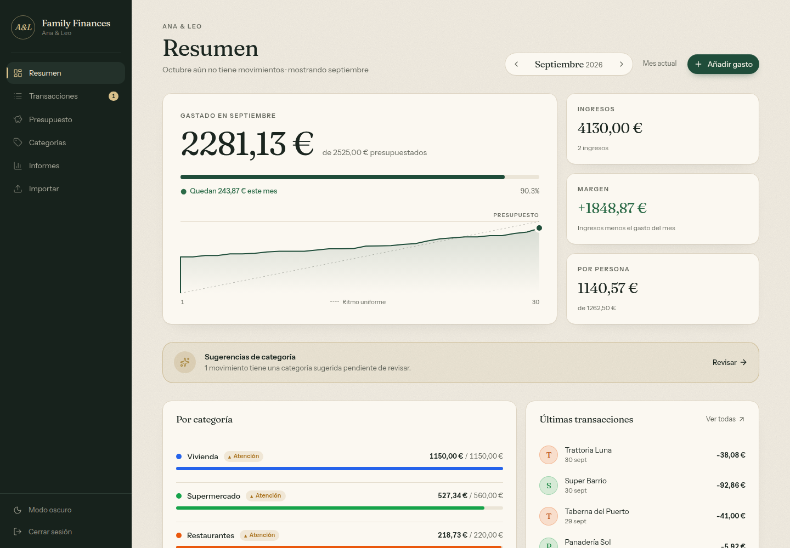
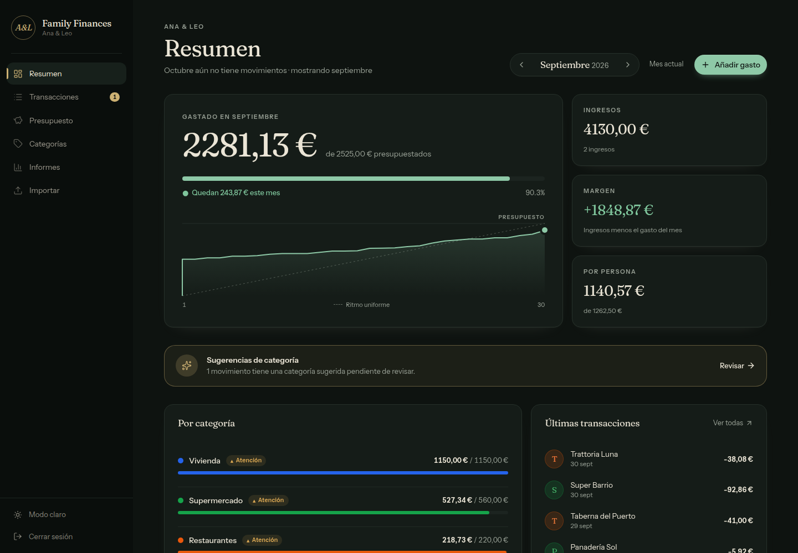
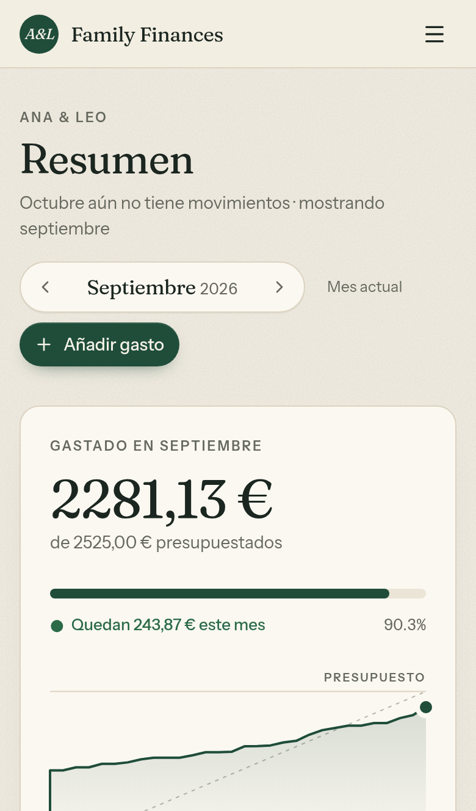
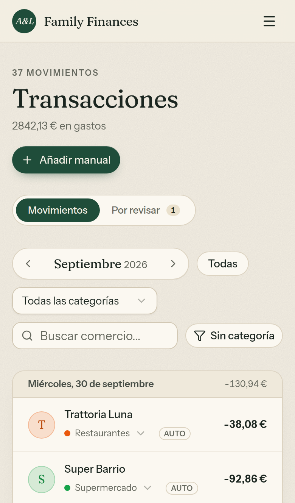
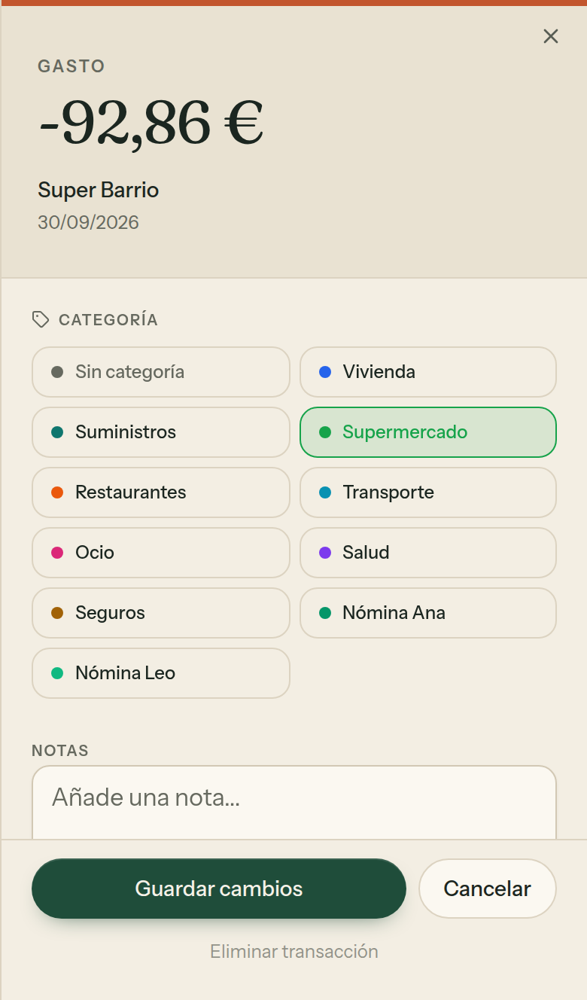

# Design

The look is called **Libreta** (Spanish for a notebook or household ledger): warm paper, pine-green ink, brass and terracotta accents, serif figures over a quiet sans. Light and dark are designed separately rather than inverted.

| Light | Dark |
| --- | --- |
|  |  |

## Tokens

Every color is a CSS variable in `app/globals.css` (`:root` for light, `.dark` for dark), exposed to Tailwind through `@theme inline`. Use the tokens. Don't hard-code `red-600`, `emerald-500`, hex values and the like in components.

| Token | Light | Dark | Use |
| --- | --- | --- | --- |
| `background` | `#f3eee3` | `#0e1310` | Page (paper) |
| `card` | `#fbf8f1` | `#151c18` | Surfaces |
| `foreground` | `#1b2620` | `#ebe5d6` | Text |
| `primary` | `#1f4d3a` | `#8ec9a7` | Pine: primary actions, meters |
| `positive` | `#2c6b48` | `#7fc59c` | Income, under budget |
| `negative` / `destructive` | `#b0432a` | `#e8876b` | Over budget, errors |
| `warning` | `#a8701a` | `#dfab55` | "Watch", uncategorized |
| `brass` | `#a8873f` | `#cdb173` | Highlights, suggestions |
| `terracotta` | `#c2552d` | `#e3825a` | Over-budget bars and pace line |
| `sidebar*` | `#17221c`… | `#0a0e0c`… | The dark navigation spine (dark in both themes) |

Category colors come from the database and are used for dots, meters, avatars and chart slices only, never for text on surfaces.

A fixed SVG noise layer (`body::before`) adds paper grain. Its opacity and blend mode are tokens too: `--grain-opacity` and `--grain-blend`.

## Theme

- The theme is the stored choice (`localStorage.theme`), falling back to the system preference.
- An inline script in `app/layout.tsx` applies it before first paint, so dark mode never flashes light.
- `ThemeToggle` reads the `<html>` class through `useSyncExternalStore`.

## Typography

- **Fraunces** (`font-display`): page titles, card titles, hero figures, month names. It is a variable font with optical sizing.
- **Instrument Sans** (`font-sans`): everything else.
- Both are loaded with `next/font/google`, so they are self-hosted at build time with no runtime request to Google.

Helper classes in `globals.css`:

| Class | Use |
| --- | --- |
| `.figures` | Tabular, lining numerals. Use it on every amount, so columns line up |
| `.eyebrow` | Small uppercase labels above titles and figures |
| `.surface` | Card background, border, radius and soft shadow |
| `animate-rise` | Entrance animation, staggered with `animationDelay`. Disabled under `prefers-reduced-motion` |

## Kit (`components/kit`)

| Component | Purpose |
| --- | --- |
| `PageHeader` | Eyebrow, serif title, subtitle, actions |
| `MonthSwitcher` | Previous / month / next, optional "current month" link |
| `Money` | Formatted amount with tabular figures; `tone` colors income, `signed` adds `+` |
| `Meter` | Thin progress bar; turns terracotta past 100 %; optional `marker` tick |
| `CategoryLine` | Budget line: name, status, spent / budgeted, meter. On phones the status and budget move under the meter |
| `PaceChart` | Cumulative spending through the month against an even pace to the budget |
| `StatusPill` | Status as glyph + word (`●` on track, `▲` watch, `■` over) |
| `MerchantAvatar` | Merchant initial on a disc tinted with its category color |
| `useInitialMonth` | Which month a page opens on (URL, current, or latest month with data) |
| `fill` | `{placeholder}` replacement for copy strings |

The shadcn/ui primitives in `components/ui` are restyled with the tokens: pill buttons, `rounded-lg` fields on `card`, and serif card titles.

## Charts and status

- **Status needs a shape and a word.** Status is never shown by color alone. Over-budget lines show `■ Exceso` and a terracotta bar; watch lines show `▲ Atención`.
- **Thin marks and quiet grids.** Bars use a 4 px top radius, grid lines are dashed `border`, and there are no dual axes.
- **Yearly report.** Spending bars turn terracotta in months over budget, and each month's budget is drawn as a tick across its bar.
- **Pace chart.** The dashed diagonal is spending evenly to the budget; the solid line is what actually happened. In the current month the line stops at today.

## Mobile

Pages are checked at 375 and 390 px (iPhone) with no horizontal overflow. Rules that keep it that way:

- **Responsive grids start from one column.** Write `grid grid-cols-1 lg:grid-cols-3`, never just `grid lg:grid-cols-3`. Without a base column count, the implicit column grows to its widest unbreakable content (a long amount) and the page scrolls sideways.
- **Flex children that hold text get `min-w-0` and `truncate`.**
- **Form fields are 16 px on phones** (`text-base md:text-sm`). iOS Safari zooms into smaller fields on focus and leaves the page zoomed in.
- **Nothing is hover-only on touch.** Use `md:opacity-0 md:group-hover:opacity-100`, not `opacity-0 group-hover:opacity-100`.
- **Sheets are full width on phones** (`w-full sm:max-w-sm`).

  
  
  

## Copy

All UI strings live in `lib/ui-copy.ts`, in English and Spanish, with the same keys in both. Add new strings to both locales; `getUiCopy` picks one from the household locale.
